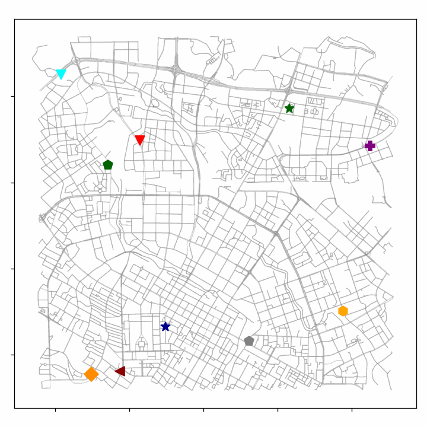
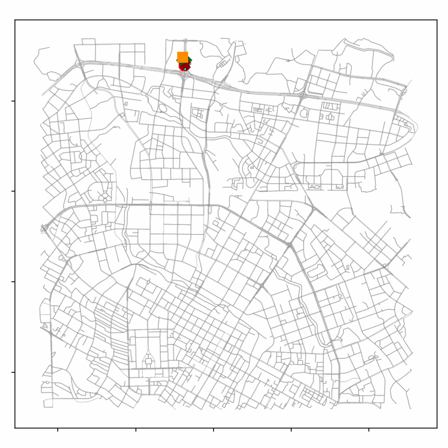
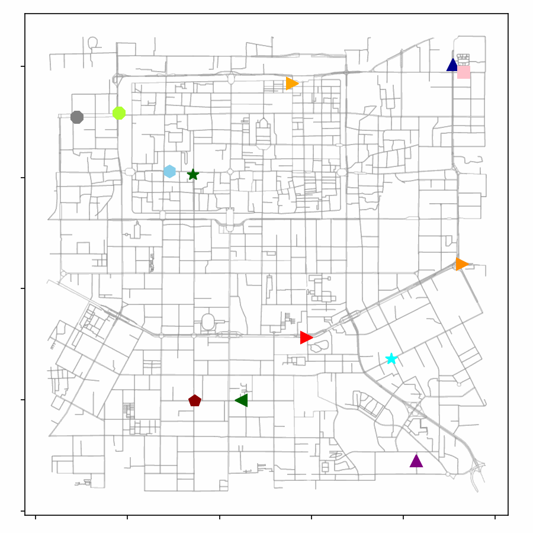
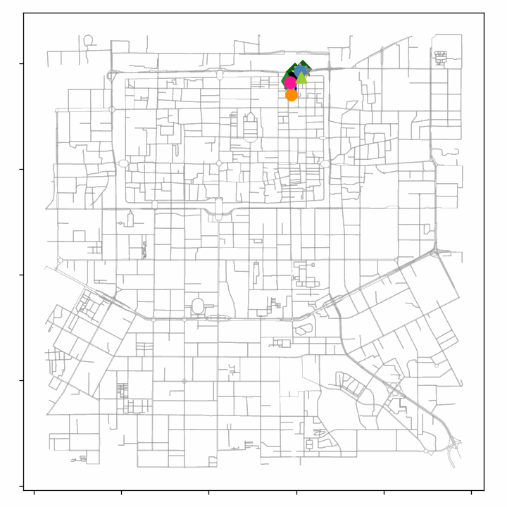

# [SynMob](https://yasoz.github.io/SynthTraj/)

## Introduction

This dataset is a high-fidelity synthetic GPS trajectory dataset designed for urban mobility analysis. The dataset consists of a large collection of synthetic GPS trajectory data that can be used for studying various aspects such as modeling real-world movement patterns, route planning, traffic flow, and more.

## Dataset Features

- **Synthetic Nature**: The trajectory data in this dataset is generated through simulation and is not real GPS data.
- **High Fidelity**: The generated trajectory data aims to preserve spatial and temporal characteristics similar to real-world data.
- **Coverage**: The dataset covers major areas in several cities, including: Chengdu and Xi'an.
- **Diversity**: The dataset includes various types of movement patterns and human behaviors.
-  **Availability**: This synthetic dataset is publicly available, and no concerns about privacy.
- **Scalability**: The trajectory synthesizer can generate an arbitrary amount of synthetic trajectories.

### Trajectories Examples





## Dataset Usage

### Data Format

The dataset is stored in the common **pickle** format, with two separate files for attribute information and trip trajectory. For attribute information, each example typically includes the following fields:

- **Trip distance**: Records the distance for each trip.
- **Trip time**: The total time of the trip
- **Departure time**: The time of trip start, with 5-min duration for each value.
- **Sample points**: Total number of trajectory sampling points for each trip.

For the trip trajectory, each sample is represented as  a sequence of successively sampled GPS points with recorded **longitude** and **latitude**, respectively

### Data Access

You can access the dataset from the following [here](https://drive.google.com/drive/folders/1WLQ-JQar1_SteDY4zP2u6rzaIbq7v2l8?usp=sharing)

### Data License

This dataset follows the [CC BY-NC-SA](https://creativecommons.org/licenses/by-nc-sa/4.0/) license. This license allows reusers to distribute, remix, adapt, and build upon the material in any medium or format for noncommercial purposes only, and only so long as attribution is given to the creator. If you remix, adapt, or build upon the material, you must license the modified material under identical terms.

### Sample Code

You can use the following sample code to load and utilize the dataset:

```
pythonCopy code
import pickle

# Load the attributes
attr_path = './attrs.pkl'
with open(attr_path, 'rb') as f:
    attrs = pickle.load(f)
   
# Load the trajectories
trajs_path = './trajs.pkl'
with open(trajs_path, 'rb') as f:
    trajs = pickle.load(f)

# Write your data analysis, model training, etc. code here
# ...
```

### Acknowledgments

The dataset is based on the [Didi Chuxing GAIA initiative](https://outreach.didichuxing.com/). All data is synthetic and removed from the privacy risk.

## Feedback and Contributions

If you have any questions or suggestions regarding the dataset, or if you would like to contribute to the dataset, please feel free to contact us or submit issues and requests. We welcome and appreciate your feedback and contributions.
